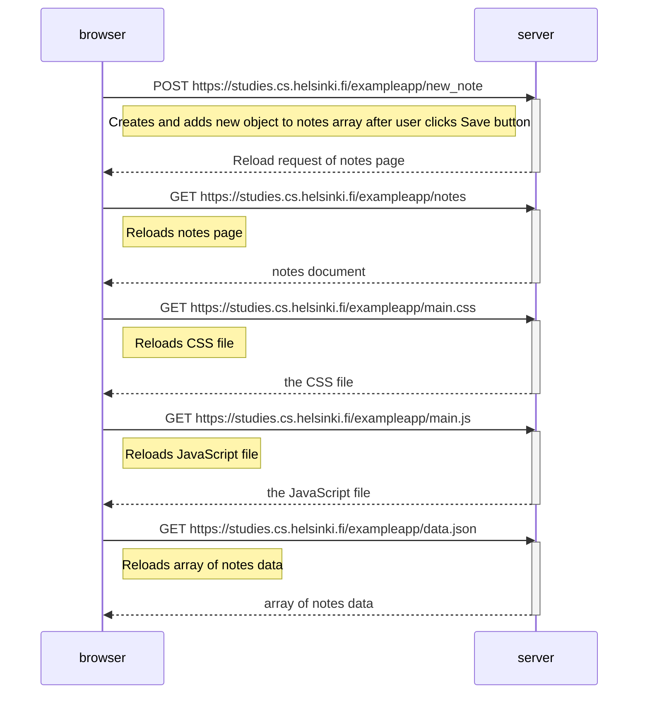

```mermaid
sequenceDiagram
    participant browser
    participant server

    browser->>server: POST https://studies.cs.helsinki.fi/exampleapp/new_note
    activate server
    Note right of browser: Creates and adds new object to notes array after user clicks Save button
    server-->>browser: Reload request of notes page
    deactivate server

    browser->>server: GET https://studies.cs.helsinki.fi/exampleapp/notes
    activate server
    Note right of browser: Reloads notes page
    server-->>browser: notes document
    deactivate server

    browser->>server: GET https://studies.cs.helsinki.fi/exampleapp/main.css
    activate server
    Note right of browser: Reloads CSS file
    server-->>browser: the CSS file
    deactivate server

    browser->>server: GET https://studies.cs.helsinki.fi/exampleapp/main.js
    activate server
    Note right of browser: Reloads JavaScript file
    server-->>browser: the JavaScript file
    deactivate server

    browser->>server: GET https://studies.cs.helsinki.fi/exampleapp/data.json
    activate server
    Note right of browser: Reloads array of notes data
    server-->>browser: array of notes data
    deactivate server
```