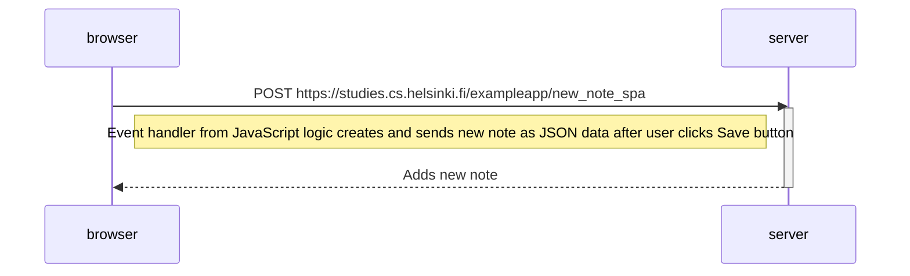

```mermaid
sequenceDiagram
    participant browser
    participant server

    browser->>server: POST https://studies.cs.helsinki.fi/exampleapp/new_note_spa
    activate server
    Note right of browser: Event handler from JavaScript logic creates and sends new note as JSON data after user clicks Save button
    server-->>browser: Adds new note
    deactivate server
```